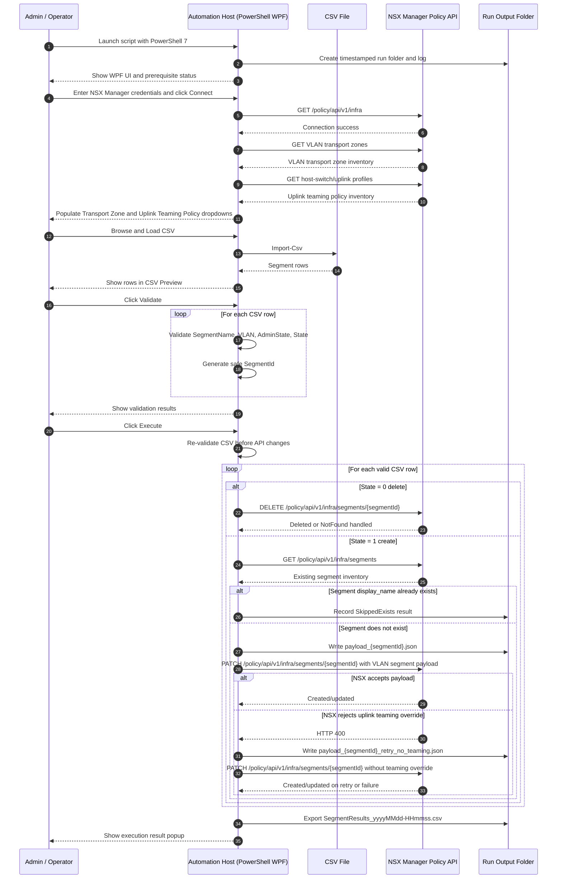

# VCF-9.1-NSX-VLAN-backed-segment-Creation-Automation


PowerShell 7 / WPF utility for bulk creation and deletion of **VCF 9.1 NSX VLAN-backed Layer 2 segments** from a CSV input file.

**Current documented release:** v1.0.7  
**Script file name:** `VCF91-NSX-VLAN-Segment-Bulk-Automation-v1.0.7.ps1`

This tool connects directly to NSX Manager, discovers VLAN transport zones and uplink teaming policies, validates a CSV, and performs create/delete actions against the NSX Policy API.

---

## Purpose

This tool provides an operator-friendly Windows UI for bulk managing NSX VLAN-backed segments in a VCF 9.1 environment.

The script is intended for environments where an administrator needs to:

- Bulk create VLAN-backed NSX segments.
- Bulk delete VLAN-backed NSX segments.
- Select the target VLAN transport zone from live NSX inventory.
- Select an uplink teaming policy from live NSX inventory.
- Keep a consistent run log and output folder per execution.
- Preview and validate CSV input before execution.
- Skip segment creation when the segment display name already exists.

The tool creates **Layer 2 VLAN-backed segments** with:

- No connected gateway.
- No subnet.
- A selected VLAN transport zone.
- A selected VLAN ID from CSV.
- Admin state controlled from CSV.
- Optional uplink teaming policy override, with automatic retry without the policy override if NSX rejects the field/value.

---

## Supported Use Case

Use this tool when you need repeatable bulk onboarding or cleanup of VLAN-backed NSX segments in VCF 9.1.

Common scenarios include:

- Migrating from vSphere Distributed Port Groups to NSX VLAN-backed segments.
- Preparing VLAN-backed workload networks for VM migration.
- Creating many VLAN segments consistently from a spreadsheet export.
- Cleaning up old VLAN-backed segments by marking them for deletion in CSV.
- Re-running the same CSV safely while skipping already-created segment names.

---

## Requirements

- Windows automation host or jump host.
- PowerShell 7 or later.
- WPF-capable Windows session.
- Network connectivity to NSX Manager over HTTPS/443.
- NSX account with permissions to read inventory and create/delete segments.
- CSV file with the required columns documented below.

The script uses PowerShell `Invoke-RestMethod` with `-SkipCertificateCheck` to support lab and self-signed NSX Manager certificates.

---

## CSV Format

The CSV must contain these columns:

```csv
SegmentName,VLAN,Description,AdminState,State
```

Example:

```csv
SegmentName,VLAN,Description,AdminState,State
VLAN1005,1005,VLAN 1005,1,1
Old-VLAN1006,1006,Remove old segment,0,0
```

### CSV Column Behavior

| Column | Required | Description |
|---|---:|---|
| `SegmentName` | Yes | NSX segment display name. The script also converts this to a safe NSX segment ID. |
| `VLAN` | Yes | VLAN ID from `0` through `4094`. |
| `Description` | No | Segment description written to NSX during create. |
| `AdminState` | Yes | `1` means `UP`; `0` means `DOWN`. |
| `State` | Yes | `1` means create/skip-if-exists; `0` means delete. |

---

## UI Workflow

The UI is organized into these areas:

- **Prerequisites**
  - PowerShell version check.
  - .NET/WPF check.
  - CSV import availability.
  - VMware PowerCLI informational status.
- **Output**
  - Output folder selector.
  - Open output folder button.
  - Current output path.
- **NSX Manager Connection**
  - NSX Manager FQDN/IP.
  - Username.
  - Password.
  - Connect button.
- **Inventory Selection**
  - VLAN Traffic Type Transport Zone dropdown.
  - Uplink Teaming Policy dropdown.
- **CSV Input and Actions**
  - Browse CSV.
  - Load CSV.
  - Sample CSV.
  - Validate.
  - Execute.
- **CSV Preview / Validation** and **Log**
  - Displayed side-by-side for easier vertical reading.

---

## How the Script Works



---

## Create Behavior

For rows where `State = 1`, the script performs the following logic:

1. Looks up existing NSX segments by `display_name`.
2. If a matching segment name is found, the script skips create/update.
3. The result is written as `SkippedExists`.
4. If no matching segment is found, the script builds a VLAN-backed segment payload.
5. The payload is written to the run folder as `payload_<segmentId>.json`.
6. The script attempts to create the segment with the selected uplink teaming policy.
7. If NSX rejects the uplink teaming override, the script retries without the policy override.
8. The retry payload is written as `payload_<segmentId>_retry_no_teaming.json`.

---

## Delete Behavior

For rows where `State = 0`, the script performs:

```text
DELETE /policy/api/v1/infra/segments/{segmentId}
```

If NSX reports that the segment does not exist, the script records the row as `NotFound` and treats this as a non-blocking outcome.

---

## Output Files

Each run creates a folder similar to:

```text
NSXVlanSegments-Run-YYYYMMDD-HHMMSS
```

Typical files include:

```text
NSXVlanSegments-YYYYMMDD-HHMMSS.log
payload_<segmentId>.json
payload_<segmentId>_retry_no_teaming.json
SegmentResults_YYYYMMDD-HHMMSS.csv
```

---

## Result Status Values

| Result | Meaning |
|---|---|
| `CreatedOrUpdated` | Segment was created or updated successfully. |
| `SkippedExists` | Segment display name already exists; create/update was skipped. |
| `Deleted` | Segment delete completed successfully. |
| `NotFound` | Delete target did not exist; treated as non-blocking. |
| `Failed` | API call or validation action failed. Check the log and result CSV. |

---

## Recommended Operational Flow

1. Place the script on the Windows automation host.
2. Launch with PowerShell 7.
3. Select or confirm the output folder.
4. Connect to NSX Manager.
5. Select the VLAN transport zone.
6. Select the uplink teaming policy.
7. Browse and load the CSV.
8. Click **Validate**.
9. Review CSV Preview / Validation output.
10. Click **Execute**.
11. Review the result popup.
12. Open the output folder and archive the log, payloads, and results CSV.
13. Validate created NSX segments in the NSX Manager UI.

---

## Troubleshooting

### Execute is disabled

Confirm:

- NSX Manager is connected.
- A VLAN transport zone is selected.
- A CSV has been loaded.

### Segment create logs HTTP 400, then succeeds on retry

This usually means NSX rejected the selected uplink teaming policy override field or value. The script retries without the override and records the primary failure in the result message.

### Segment shows `SkippedExists`

The script found an existing NSX segment with the same display name and skipped create/update as requested.

### Delete returns `NotFound`

The requested segment ID was not present in NSX. The script treats this as non-blocking because the desired delete state is already satisfied.

### Transport zone dropdown is empty

Confirm the connected NSX Manager has VLAN-backed transport zones and that the account can read transport zone inventory.

---

## Security Notes

- Passwords are not saved to disk by the script.
- The NSX password is held only in memory for the session.
- The script uses Basic authentication to NSX Manager over HTTPS.
- Self-signed certificates are supported through `-SkipCertificateCheck`.
- Output payload files may contain segment names, VLAN IDs, transport zone paths, and descriptions.

---

## Disclaimer

Validate this workflow in a controlled environment before production use. Ensure the selected transport zone, VLAN IDs, and uplink teaming policy selections match the target network design.

