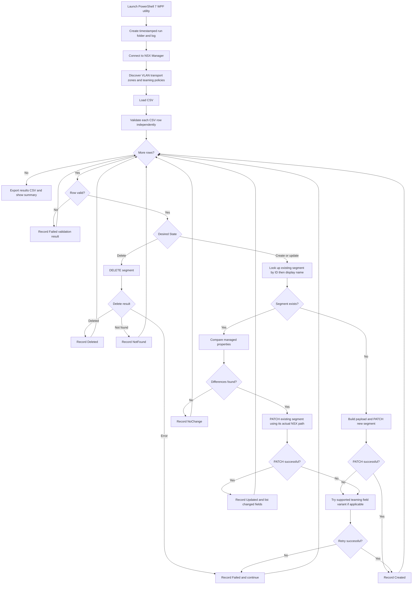

# VCF 9.1 NSX VLAN Segment Bulk Automation

PowerShell 7 and WPF utility for bulk creating, updating, and deleting **VCF 9.1 NSX VLAN-backed Layer 2 segments** from CSV input.

**Current release:** v1.1.0  
**Script:** `VCF91-NSX-VLAN-Segment-Bulk-Automation-v1.1.0.ps1`

## Overview

The utility connects directly to NSX Manager, discovers VLAN transport zones and uplink teaming policies, validates CSV input, and applies each requested segment operation independently through the NSX Policy API.

Version 1.1.0 adds idempotent create-or-update behavior. When a segment already exists, the utility compares its managed properties with the requested configuration. It updates the segment only when differences are found and records the changed fields in the run log and results CSV. A validation or API error affecting one row does not stop the remaining rows from being processed.

## Key Capabilities

- Bulk create VLAN-backed NSX segments.
- Update existing segments when managed properties differ.
- Skip API writes when an existing segment already matches the requested state.
- Bulk delete segments.
- Continue processing after a single-row validation or API failure.
- Select a VLAN transport zone from live NSX inventory.
- Select an uplink teaming policy discovered from the selected transport zone.
- Retry supported teaming-policy JSON field variants when required.
- Preview and validate CSV input before execution.
- Produce timestamped logs, request payloads, and a per-row results CSV.

## Managed Segment Properties

For rows with `State=1`, the utility creates a new segment or compares and manages these properties on an existing segment:

- Display name
- Description
- Transport zone path
- VLAN ID
- Admin state
- Uplink teaming policy

Properties outside this list are not intentionally compared or managed by this release.

## Requirements

- Windows automation host or jump host
- PowerShell 7 or later
- Interactive Windows session with WPF support
- Network connectivity to NSX Manager over HTTPS/443
- NSX account with permission to read inventory and create, update, or delete segments
- CSV file using the format described below

VMware PowerCLI is detected for informational purposes but is not required. The script uses `Invoke-RestMethod` and `-SkipCertificateCheck` to support lab systems and NSX Managers using self-signed certificates.

## CSV Format

Required header:

```csv
SegmentName,VLAN,Description,AdminState,State
```

Example:

```csv
SegmentName,VLAN,Description,AdminState,State
VLAN1005,1005,VLAN 1005,1,1
Old-VLAN1006,1006,Remove old segment,0,0
```

### Column Reference

| Column | Required | Accepted values | Behavior |
|---|---:|---|---|
| `SegmentName` | Yes | Non-empty name | Display name; also converted into a safe NSX segment ID for direct lookup. |
| `VLAN` | Yes | Integer from `0` through `4094` | VLAN ID applied to a created or updated segment. |
| `Description` | No | Text | Segment description. An empty value requests an empty description. |
| `AdminState` | Yes | `1` or `0` | `1` maps to `UP`; `0` maps to `DOWN`. |
| `State` | Yes | `1` or `0` | `1` means create or update; `0` means delete. |

## Processing Flow


```mermaid
flowchart TD
    A[Launch PowerShell 7 WPF utility] --> B[Create timestamped run folder and log]
    B --> C[Connect to NSX Manager]
    C --> D[Discover VLAN transport zones and teaming policies]
    D --> E[Load CSV]
    E --> F[Validate each CSV row independently]
    F --> G{More rows?}
    G -->|No| Z[Export results CSV and show summary]
    G -->|Yes| H{Row valid?}
    H -->|No| I[Record Failed validation result]
    I --> G
    H -->|Yes| J{Desired State}
    J -->|Delete| K[DELETE segment]
    K --> L{Delete result}
    L -->|Deleted| M[Record Deleted]
    L -->|Not found| N[Record NotFound]
    L -->|Error| O[Record Failed and continue]
    M --> G
    N --> G
    O --> G
    J -->|Create or update| P[Look up existing segment by ID then display name]
    P --> Q{Segment exists?}
    Q -->|No| R[Build payload and PATCH new segment]
    R --> S{PATCH successful?}
    S -->|Yes| T[Record Created]
    S -->|No| U[Try supported teaming field variant if applicable]
    U --> V{Retry successful?}
    V -->|Yes| T
    V -->|No| O
    T --> G
    Q -->|Yes| W[Compare managed properties]
    W --> X{Differences found?}
    X -->|No| Y[Record NoChange]
    Y --> G
    X -->|Yes| AA[PATCH existing segment using its actual NSX path]
    AA --> AB{PATCH successful?}
    AB -->|Yes| AC[Record Updated and list changed fields]
    AB -->|No| U
    AC --> G
```

## UI Workflow

1. Launch the script with PowerShell 7.
2. Confirm the prerequisite status.
3. Choose an output folder if the default is not appropriate.
4. Enter the NSX Manager FQDN or IP address and credentials.
5. Select **Connect**.
6. Select a VLAN transport zone.
7. Select an uplink teaming policy or the default option.
8. Browse to and load the CSV.
9. Select **Validate** to review row-level validation.
10. Select **Execute**.
11. Review the execution summary, log, payload files, and results CSV.

## Create and Update Behavior

For a valid row with `State=1`:

1. The script performs a direct lookup using the normalized segment ID.
2. If that lookup does not return a segment, it searches the segment collection for a case-insensitive display-name match.
3. For a new segment, it builds and sends a VLAN-backed segment payload using `PATCH`.
4. For an existing segment, it uses the segment's actual NSX path and compares the managed properties.
5. If differences exist, it sends an updated payload and logs the changed fields.
6. If no differences exist, it records `NoChange` and does not send a `PATCH` request.
7. When a non-default teaming policy is selected, the script can try both supported JSON field variants if the first request is rejected.

> **Important:** An empty optional CSV value is treated as the requested value. For example, an empty `Description` can clear an existing description.

## Delete Behavior

For a valid row with `State=0`, the script sends:

```text
DELETE /policy/api/v1/infra/segments/{segmentId}
```

A successful delete is recorded as `Deleted`. If NSX reports that the segment does not exist, the row is recorded as `NotFound` and processing continues.

## Error Isolation and Continuation

Execution is row-isolated:

- Invalid rows are recorded as `Failed` with their validation message.
- API failures are recorded as `Failed` with the returned error detail.
- The script logs that processing will continue.
- Remaining rows are processed normally.
- The final dialog reports the number of failed rows and points to the results CSV.

A setup-level failure, such as no NSX session or an invalid selected transport-zone path, can still prevent the run because no row can be processed safely.

## Output Files

Each run creates a directory similar to:

```text
NSXVlanSegments-Run-YYYYMMDD-HHMMSS
```

Typical contents:

```text
NSXVlanSegments-YYYYMMDD-HHMMSS.log
payload_<segmentId>_<teamingField>.json
payload_<segmentId>_no_teaming.json
SegmentResults_YYYYMMDD-HHMMSS.csv
```

Payload files are generated for create or update attempts. A segment that produces `NoChange` does not require a payload file.

## Result Status Values

| Result | Meaning |
|---|---|
| `Created` | A new segment was created successfully. |
| `Updated` | An existing segment was changed successfully. The message lists changed fields. |
| `NoChange` | The existing segment already matched the requested managed properties. |
| `Deleted` | The segment was deleted successfully. |
| `NotFound` | A delete target did not exist; the desired absent state was already satisfied. |
| `Failed` | Validation or an NSX API operation failed for that row; later rows continued. |

## Logging Examples

```text
[INFO] Updating segment 'VLAN1005' at '/policy/api/v1/infra/segments/vlan1005'. Changed fields: transport_zone_path, description.
[INFO] Segment 'VLAN1005' updated successfully. Changed fields: transport_zone_path, description.
[INFO] Segment 'VLAN1007' already matches the requested configuration. No change made.
[ERROR] Segment 'VLAN1008' failed: NSX API call failed: PATCH ... Continuing with remaining rows.
```

## Troubleshooting

### Execute is disabled

Confirm that:

- The NSX Manager connection succeeded.
- A VLAN transport zone is selected.
- A CSV file has been loaded.

### One row shows Failed but later rows succeeded

This is expected in v1.1.0. Review the row's `Message` in the results CSV and the corresponding log entry. Correct the input or NSX condition, then rerun the CSV. Rows already matching the requested state should return `NoChange`.

### A segment unexpectedly shows Updated

Review the `Changed fields` list in the log and results CSV. Common causes include:

- A different selected transport zone
- A changed VLAN ID
- Description whitespace or content differences
- A different admin state
- A different teaming-policy selection

### Teaming-policy PATCH fails and retries

NSX versions or configurations may accept different advanced-config field names. The script tries the supported variants when a policy override is selected. If both attempts fail, that row is recorded as `Failed` and execution continues.

### Transport-zone dropdown is empty

Verify that the connected NSX Manager contains VLAN-backed transport zones and that the account can read transport-zone inventory.

## Security Notes

- Passwords are not written to disk.
- The password is retained only in memory for the running session.
- Basic authentication is sent over HTTPS.
- Self-signed certificates are accepted through `-SkipCertificateCheck`.
- Logs, payloads, and results may contain segment names, VLAN IDs, descriptions, transport-zone paths, and teaming-policy names.
- Protect and retain output according to your organization's operational and security requirements.

## Version History

### v1.1.0

- Added comparison-based updates for existing segments.
- Added transport-zone, VLAN, description, admin-state, display-name, and teaming-policy change detection.
- Added `Created`, `Updated`, and `NoChange` result distinctions.
- Added changed-field reporting in logs and the results CSV.
- Added row-level validation failure reporting during execution.
- Ensured a failed row does not stop processing of later rows.
- Updated execution warning text to describe update and continuation behavior.

### v1.0.x

- Initial WPF interface and NSX connectivity.
- CSV validation and preview.
- VLAN transport-zone and teaming-policy discovery.
- Bulk create and delete operations.
- Existing segments were skipped instead of updated.

## Operational Guidance

Test each new release in a controlled, nonproduction environment before production use. Verify that the selected transport zone, VLAN IDs, admin states, and teaming policies match the intended network design. Retain the prior script version and run outputs for rollback and audit purposes.
